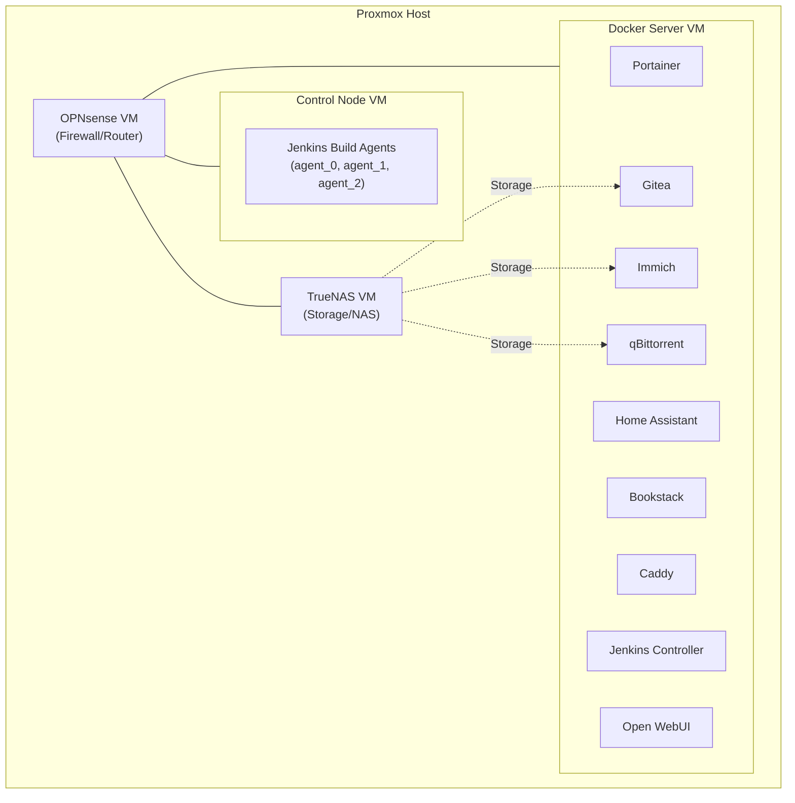

# Homelab

This repository contains the Docker Compose configurations for various services hosted in my personal homelab. The homelab is structured as a series of virtual machines on a Proxmox host, with this repository specifically targeting the **Docker Server VM** (Ubuntu Server).

## Architecture & General Information

The Docker Server VM is part of a broader infrastructure running on Proxmox. 

The main components of the lab are:
- **OPNsense**: Primary firewall and router for the home network.
- **TrueNAS**: Centralized storage. Services like Immich, Gitea, and qBittorrent use NFS/SMB shares on TrueNAS for persistent data and media storage.
- **Docker Server**: A dedicated Ubuntu Server VM running the primary application stack and the Jenkins Controller.
- **Control Node**: A dedicated VM hosting specialized Jenkins build agents (agent_0, agent_1, agent_2).

### System Diagram



## Hosted Services

### Core Infrastructure
- **[Caddy](https://caddyserver.com)**: Acts as the primary reverse proxy with automated SSL. It uses a custom build (`xcaddy`) to include the DuckDNS plugin for DNS-01 challenges, allowing SSL for internal services without exposing ports.
- **[Portainer](https://www.portainer.io)**: A lightweight management UI that allows for easy monitoring and management of the Docker environment.
- **[Jenkins](https://www.jenkins.io/)**: The automation hub. The controller runs on the Docker Server, while specialized agents run on the Control Node:
  - `agent_0`: Infrastructure tools (Terraform, Ansible).
  - `agent_1`: Build tools (C++, CMake, GCC).
  - `agent_2`: Documentation (LaTeX).

### Home Automation
- **[Home Assistant](https://www.home-assistant.io)**: The heart of the smart home, running in `host` network mode for seamless device discovery.
- **Zigbee2MQTT & Mosquitto**: Handles the Zigbee mesh network and MQTT messaging for home sensors and switches.

### AI Tools
- **[Open WebUI](https://openwebui.com)**: A ChatGPT-like interface for interacting with various LLMs (typically connecting to an external Ollama instance).

### Data & Productivity
- **[Immich](https://immich.app)**: High-performance self-hosted photo and video management solution, configured to store backups directly on the TrueNAS VM.
- **[Gitea](https://about.gitea.com)**: A painless self-hosted Git service, providing local version control for all homelab projects.
- **[Bookstack](https://www.bookstackapp.com)**: A simple, self-hosted platform for organizing and storing documentation and wiki content.

### Media & Utilities
- **[qBittorrent](https://www.qbittorrent.org)**: A reliable torrent client with a web interface, configured to save downloads directly to the NAS.
- **[Vaultwarden](https://github.com/dani-garcia/vaultwarden)**: Secure, self-hosted password management.

## Deployment & Maintenance

### Configuration
- **Environment Variables**: Local `.env` files are used extensively for sensitive data and system-specific paths. These are ignored by Git.
- **Storage**: Persistent data is generally stored in directories defined by `${BASE_PATH_APPNAME}` variables (e.g., `BASE_PATH_JENKINS=/opt/jenkins`) or on mapped network shares from TrueNAS.
- **Networking**: Most services run on a custom bridge network with static IP assignments for consistent internal routing.

### Available Scripts
The following scripts are available in the `scripts/` directory to automate common tasks:

*   **`scripts/manage_stack.sh`**: Iterates through all service directories, pulls the latest images, and starts (or updates) the containers in detached mode.
    *   **Usage**: `./scripts/manage_stack.sh [-e <exclude_dir>]`
    *   **Flags**: `-e` allows excluding specific service directories (can be used multiple times).
*   **`scripts/backup_stack.sh`**: Scans all service `.env` files for `BASE_PATH_*` variables and creates timestamped `.tar.gz` backups of those directories.
    *   **Usage**: `./scripts/backup_stack.sh [-d <destination_dir>] [-v]`
    *   **Flags**: `-d` sets a custom backup destination (default: `backups/`); `-v` enables verbose output.
*   **`caddy/deploy_caddyfile.sh`**: Securely deploys the `Caddyfile` to the host directory defined by `${BASE_PATH_CADDY}`, ensuring correct ownership (`root:root`) and permissions (`644`).

## Environment Configuration

A `.env` file should be present in each service directory. These files are used to define system-specific paths, ports, and resource quotas. Below is an indicative sample for a single service (e.g., `gitea/.env`):

```env
# --- Network ---
SUBNET=X.X.X.X/X
GITEA_IPV4=X.X.X.X

# --- Persistence ---
MAIN_PATH=/path/to/your/storage

# --- Ports ---
GITEA_WEBUI_PORT=XXXX
GITEA_SSH_PORT=XXXX

# --- Resource Quotas ---
GITEA_CPU_LIMIT=0.5
GITEA_MEM_LIMIT=512M
GITEA_CPU_RESERV=0.1
GITEA_MEM_RESERV=128M
```

## Future Plans

### Maintenance & Developer Experience (DX)
- **Validation**: Always validate configurations before reloading services.
    - Example: `docker exec -it caddy caddy validate --config /etc/caddy/Caddyfile`
- **Automation (Planned)**: A root-level `Makefile` is planned to centralize common tasks like `pull`, `build`, and `logs` across all service stacks using the provided scripts.


### Infrastructure Evolution
- **High Availability**: Adding a second Proxmox node for failover and redundant storage.
- **VPN Integration**: Implementing a WireGuard or Tailscale solution for secure remote access.
- **Kubernetes**: Planning a migration from Docker Compose to K3s once additional hardware is available.

### Docker Best Practices & Hardening
- **Resource Quotas**: Implement CPU and Memory limits across all services to prevent resource starvation and improve host stability.
- **Security Hardening**:
  - Transition services to run as non-root users where supported.
  - Implement `read_only: true` for root filesystems with specific `tmpfs` mounts for temporary data.
  - Utilize `cap_drop: [ALL]` and only add back necessary capabilities to minimize the attack surface.
- **Reliability & Health**: 
  - Add `healthcheck` definitions to all critical services (Caddy, Gitea, etc.) for better orchestration and automated recovery.
  - Implement centralized logging with rotation limits to prevent disk space exhaustion.
- **Reproducibility**: Move away from `latest` image tags in favor of pinned versions to ensure consistent and predictable deployments.
