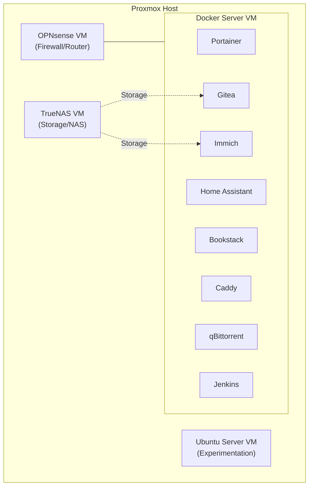

# Homelab

This repository contains the Docker Compose configurations for various services hosted in my personal homelab. The homelab is structured as a series of virtual machines on a Proxmox host, with this repository specifically targeting the **Docker Server VM** (Ubuntu Server).

## Architecture & General Information

The Docker Server VM is part of a broader infrastructure running on Proxmox. 

The main components of the lab are:
- **OPNsense**: Primary firewall and router for the home network.
- **TrueNAS**: Centralized storage. Services like Immich and Gitea use NFS/SMB shares on TrueNAS for persistent data.
- **Docker Server**: A dedicated Ubuntu Server VM running the services defined in this repository.
- **Ubuntu Server**: A secondary VM used for testing and isolated experiments.

### System Diagram

## Hosted Services

### Core Infrastructure
- **[Caddy](https://caddyserver.com)**: Acts as the primary reverse proxy with automated SSL. It uses a custom build (`xcaddy`) to include the DuckDNS plugin for DNS-01 challenges, allowing SSL for internal services without exposing ports.
- **[Portainer](https://www.portainer.io)**: A lightweight management UI that allows for easy monitoring and management of the Docker environment.
- **[Jenkins](https://www.jenkins.io/)**: The automation hub. Includes a custom controller and three specialized agents:
  - `agent_0`: Infrastructure tools (Terraform, Ansible).
  - `agent_1`: Build tools (C++, CMake, GCC).
  - `agent_2`: Documentation (LaTeX).

### Home Automation
- **[Home Assistant](https://www.home-assistant.io)**: The heart of the smart home, running in `host` network mode for seamless device discovery.
- **Zigbee2MQTT & Mosquitto**: Handles the Zigbee mesh network and MQTT messaging for home sensors and switches.

### Data & Productivity
- **[Immich](https://immich.app)**: High-performance self-hosted photo and video management solution, configured to store backups directly on the TrueNAS VM.
- **[Gitea](https://about.gitea.com)**: A painless self-hosted Git service, providing local version control for all homelab projects.
- **[Bookstack](https://www.bookstackapp.com)**: A simple, self-hosted platform for organizing and storing documentation and wiki content.

### Media & Utilities
- **[qBittorrent](https://www.qbittorrent.org)**: A reliable torrent client with a web interface, configured to save downloads directly to the NAS.
- **[Bitwarden](https://bitwarden.com)**: Secure, self-hosted password management.

## Deployment & Maintenance

### Configuration
- **Environment Variables**: Local `.env` files are used extensively for sensitive data and system-specific paths. These are ignored by Git.
- **Storage**: Persistent data is generally stored in `/opt/` or on mapped network shares from TrueNAS.
- **Networking**: Most services run on a custom bridge network with static IP assignments for consistent internal routing.

## Future Plans

### Infrastructure Evolution
- **High Availability**: Adding a second Proxmox node for failover and redundant storage.
- **VPN Integration**: Implementing a WireGuard or Tailscale solution for secure remote access.
- **Kubernetes**: Planning a migration from Docker Compose to K3s once additional hardware is available.

### Docker Best Practices & Hardening
- **Resource Quotas**: Implement CPU and Memory limits across all services to prevent resource starvation and improve host stability.
- **Security Hardening**:
  - Transition services to run as non-root users where supported.
  - Implement `read_only: true` for root filesystems with specific `tmpfs` mounts for temporary data.
  - Utilize `cap_drop: [ALL]` and only add back necessary capabilities to minimize the attack surface.
- **Reliability & Health**: 
  - Add `healthcheck` definitions to all critical services (Caddy, Gitea, etc.) for better orchestration and automated recovery.
  - Implement centralized logging with rotation limits to prevent disk space exhaustion.
- **Reproducibility**: Move away from `latest` image tags in favor of pinned versions to ensure consistent and predictable deployments.
